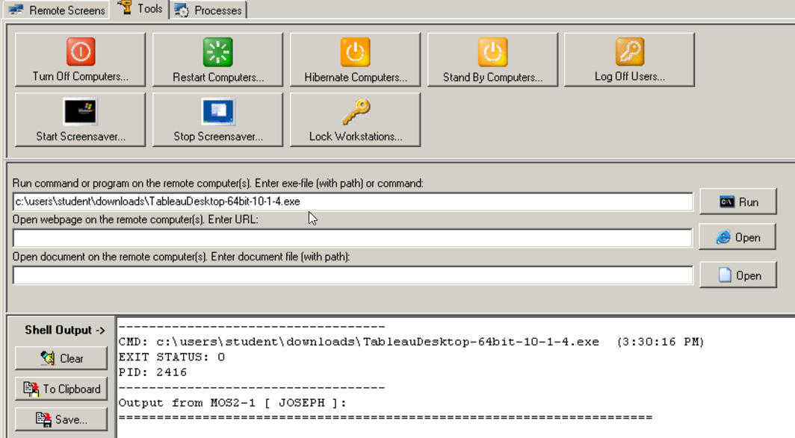
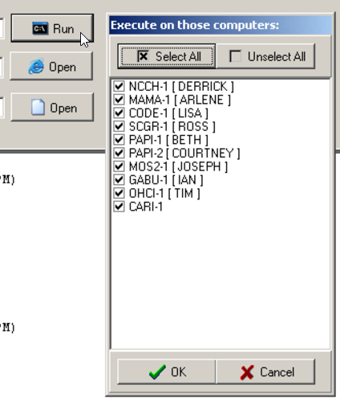
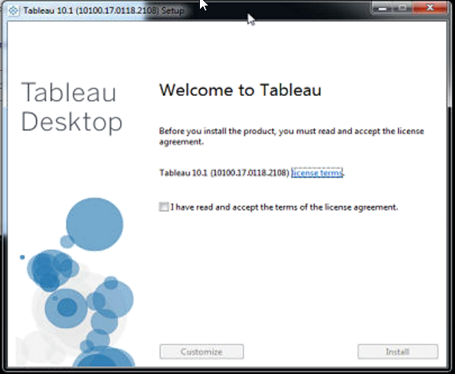
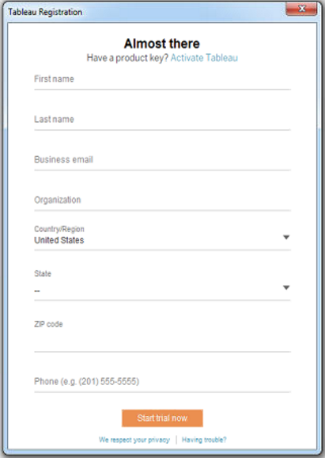
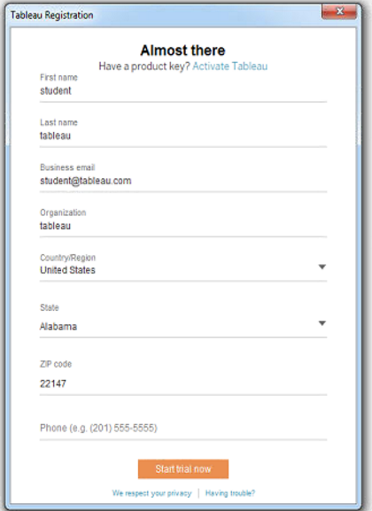

**[LAB Book partners up with Practical Tableau Book:]{.underline}**

Part 1 --

Chapter 8 - Exercise 1 (Bar Chart Options) - 10 Minutes

1.  **Use Excel Sample Superstore, ORDERS table:**

{width="6.5in" height="3.9305555555555554in"}

2.  **Rename Sheet 1 to Bar Chart Options (which will also change the
    title of the page to "Bar Chart Options" -- Additionally: right
    click the sheet tab and choose "color" off the menu. (\*note: these
    colors are your preference, but back at work, you may consider using
    them to differentiate departments, or sheets vs. dashboards, or
    projects, etc.)**

{width="4.1427504374453195in"
height="1.5208333333333333in"}

3.  **SAVE Entire Workbook to your desktop. Name the File:
    "PartOneChartOptions.twbx" -- you will use this workbook throughout
    Part One of Practical Tableau Book.**

4.  **Once you have the steps above opened, you will try each of the
    FIVE bar chart options discussed in your book on pages 35 and 36.
    Please follow the steps below to complete these five options:**

**Option 1** -- Double Click the SALES Measure. Result: plain blue bar
chart -- click the undo button

\*\*\*\*

**Option 2** -- Left Drag your SALES Measure to the row --Result: same
blue bar chart as above -- click the undo button

\*\*\*\*

**Option 3 --** Click ONCE on the SALES Measure, Go to the SHOW ME Box
and select the bar chart (3^rd^ row, 1^st^ column) -- Notice the bar
chart by default is horizontal. Also Note that the Show Me Wizard
changed the position of your SALES Field. It is now located in the
Column Shelf.

Find the "SWAP" tool on the toolbar (or press CTRL + W)

{width="7.5in" height="1.2916666666666667in"}

Additionally: Click the swap tool again to watch it toggle back and
forth between horizontal and vertical. (Notice your SALES measure moving
back and forth between Column and Row Shelves.

CLEAR THE WORKSHEET: (Find "CLEAR" tool and click or press
ALT\_SHIFT\_BACKSPACE)

{width="7.5in" height="0.88125in"}

\*\*\*\*

**Option 4 --** Change to a bar chart using the MARKS SHELF:

Drag YEAR/ORDER Date Dimension to the Column Shelf, Drag SALES Measure
to Rows Shelf (see picture on Page 36 of your book).

Go to the MARKS Shelf and Choose BAR CHART from the options:

{width="2.156550743657043in"
height="2.0836242344706912in"}(Notice that when you use the MARKS shelf,
as opposed to the "SHOW ME" Wizard, your SALES and ORDER DATE field
remain in place. As you learn more about Tableau, you will rely less and
less on the Wizard and learn to use the MARKS Shelf to create your
charts)

CLEAR the Worksheet

\*\*\*

**Option 5** -- RIGHT Click and Drag the SALES Measure to the ROWS
Shelf. (Result: See picture on Page 37 of your book.) -- This result
gives an option to choose an aggregate. Choose MEDIAN(SALES), Choice \#
2 from List. A right click in Tableau can offer quicker options than
going through many menus to get the desired result.

**SAVE THE WORKBOOK and keep this worksheet open for next exercise.**

Chapter 8 - Exercise 2 (Bar Chart Analytics) - 5 Minutes

Continuing with MEDIAN(SALES) on ROW SHELF , drag REGION to the COLUMNS
SHELF AND a second REGION pill to the COLOR Card On the MARKS Shelf).

Next, Click on the Analytics TAB

Under "Custom", Choose "Reference Line" -- then drag and drop on top of
TABLE

{width="4.302083333333333in"
height="1.8387423447069116in"}

You will see the screen below. Pick "Median" from the computation
dropdown AND choose a line color from the Line Dropdown:

{width="4.28125in" height="2.424058398950131in"}

Repeat these actions twice more, once to depict MINIMUM and once to
depict MAXIMUM:

Your final result should look like this:

{width="5.208333333333333in"
height="3.08834864391951in"}

SAVE YOUR WORKBOOK

Chapter 9 - Exercise 1 (Line Graphs/Axes/Dates) - 10 Minutes

1.  Add a new sheet to your workbook. Name the Sheet "Line Graphs" and
    additionally, change the color if desired.

2.  Double click Sales Measure (to bring it to ROW SHELF)

3.  RIGHT CLICK and DRAG the Order Date Field into the COLUMN SHELF.
    From the pop up menu, choose the GREEN (Continuous) - MONTH(Order
    Date) (4^th^ from bottom), off the list.

4.  Click on the COLOR CARD in the MARKS SHELF and choose the middle
    marker toward the bottom.

    -   Notice that the SORT tools are not available for the Order Date
        Field. Continuous fields cannot be sorted.

    -   Notice that Tableau associates time with Line Charts by default.

    -   See picture on page 41 of your book to confirm result.

5.  Drag the "Ship Mode" dimension to the Row.

    -   Notice that the pill only goes in FRONT of the Sales Measure.
        You cannot move it afterward. This is because it is a SLICER and
        the SLICE happens before the SALES Measure.

    -   Notice that each Axis has the same range. If we want to reflect
        accurately, we need to change this.

6.  Right click any SALES axis field (left side of view), and choose
    "Edit Axis". Under Range, choose "Independent Axis Ranges for each
    row or Column"

    -   Check result with page 44 picture in your book.

7.  Go to the GREEN -- ORDER DATE pill and click the plus sign twice to
    see how the DATE HEIRACHY works. Also, you can DRILL UP by clicking
    the plus signs again, to go backwards.

8.  Next, remove the GREEN ORDER DATE PILL from the COLUMN Shelf (RIGHT
    CLICK a white part of the column shelf and choose "CLEAR SHELF".

9.  LEFT DRAG the ORDER DATE field to the COLUMN SHELF. Leave it blue
    (discrete). Notice it CAN be sorted. We did not filter this for
    months, so note the plus sign starts on the YEAR option. . You can
    click the hierarchy plus signs all the way through to the DAY. Then,
    you can click the plus signs and drill back down. The main
    difference is that you can SORT Discreet fields.

{width="7.5in" height="1.3430555555555554in"}

10. Additionally, feel free to use plus signs and sort tools to practice
    with DATES and HEIRARCHIES.

11. Save the workbook.

    Chapter 10 - Exercise 1 (Level of Detail and Scatters) - 10 Minutes

<!-- -->

1.  Get a new worksheet, name it "Level of Detail" and color if desired.

2.
